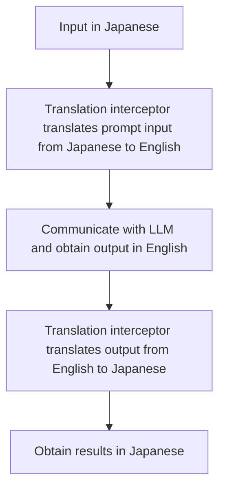

### Application Example: Prompt Interceptor
In `TextLLMPromptRunner`, there's an interface called "Interceptor (`PromptInterceptor`)" for pre-processing and post-processing prompts.

By using the `PromptInterceptor`, you can modify the input before executing the prompt and modify the output after the prompt has been executed.

For instance, by using the `ValueTranslationInterceptor`, **while it appears that the user is communicating in Japanese, the actual communication with the LLM is done in English**.



##### Input/Output Translation Interceptor Implementation Example

This complex process can be achieved with just a few changes in PromptoGen. The actual LLM for prompt execution and the LLM for translation can use different models.

```python
import promptogen as pg
from promptogen.prompt_interceptor.translation_interceptor import ValueTranslationInterceptor

formatter = pg.KeyValuePromptFormatter()
llm = YourTextLLM(model="your-model")
translator_llm = YourTextLLM(model="your-model-translator")

interceptors = [
    ValueTranslationInterceptor(llm=translator_llm, from_lang="Japanese", to_lang="English"),
]

prompt_runner = pg.TextLLMPromptRunner(llm=llm, formatter=formatter, interceptors=interceptors)
# ...(omitted)
```

## Implementation Example (GitHub)

[translation_interceptor.py (GitHub)](https://github.com/zawakin/promptogen/blob/main/examples/prompt_interceptor/translation_interceptor.py)
