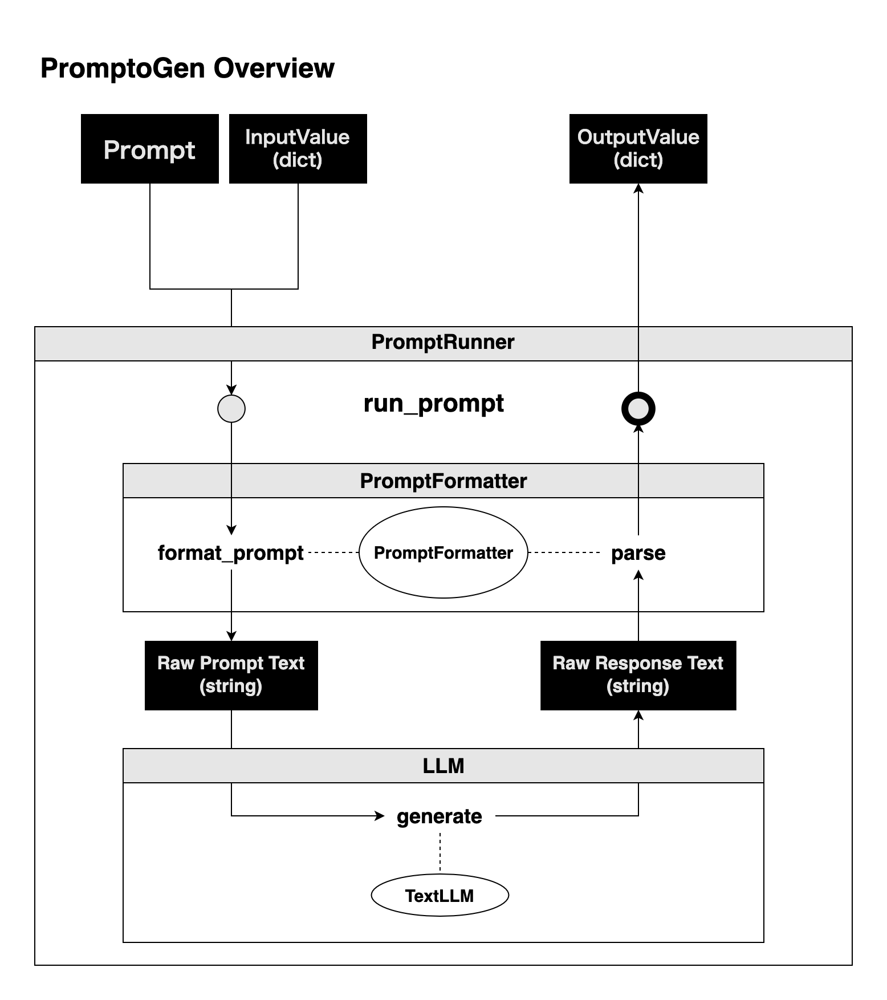

## What is PromptoGen?

PromptoGen is a Python library that assists in generating and managing prompts for large language models. By using this library, you can define prompts and their input/output parameters, format them, and convert them into strings. Moreover, you can parse the output from large language models and convert it into Python objects.

PromptoGen offers the following features:

- Definition of prompts and their input/output parameters
- Formatting of prompts and input parameters (conversion to strings)
- Parsing the output from large language models and converting to Python objects

PromptoGen streamlines the generation and management of prompts when utilizing large language models. This reduces the effort users have to put into creating and managing prompts, allowing them to spend more time interacting with the model and analyzing its results.

