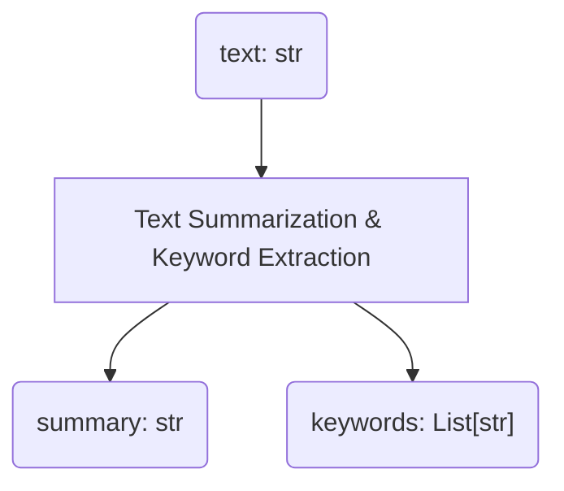

## Creating a Text Summarization & Keyword Extraction Prompt

First, let's create a prompt. In this quick start guide, we'll create a prompt that takes a text as input and outputs a summary and keywords of that text.

In other words, we'll create a prompt that implements the function `(text: str) -> (summary: str, keywords: List[str])`.



PromptoGen provides a data class (`pg.Prompt`) to represent prompts.
We will create a prompt using this data class.
This data class inherits from `pydantic.BaseModel`.

To create a prompt, the following information is needed:

| Item                        | Argument Name                 | Type                                |
|-----------------------------|-------------------------------|-------------------------------------|
| Prompt Name                 | `name`                        | `str`                               |
| Prompt Description          | `description`                 | `str`                               |
| List of Input Parameters    | `input_parameters`            | `List[pg.ParameterInfo]`            |
| List of Output Parameters   | `output_parameters`           | `List[pg.ParameterInfo]`            |
| Input/Output Template       | `template`                    | `pg.IOExample`                      |
| List of Input/Output Examples | `examples`                  | `List[pg.IOExample]`                |

Using this information, we'll create the prompt.

```python title="quickstart.py"
--8<-- "quickstart/quickstart.py:import"

--8<-- "quickstart/quickstart.py:summarizer"
```

## Formatting the Prompt as a String without Input Parameters

First, let's try formatting the prompt as a string without any input parameters.

With PromptoGen, you can flexibly create formatters to turn prompts into strings.

Here, we'll use a formatter called `KeyValuePromptFormatter`, which outputs the keys and values of input/output variables in the form of `key: value`.

To format a string without input parameters, use the `format_prompt_without_input` method of the formatter.
This method takes the prompt and formatter as arguments and formats the prompt into a string.

```python title="quickstart.py" hl_lines="8-9"
--8<-- "quickstart/quickstart.py:import"

--8<-- "quickstart/quickstart.py:summarizer_omit"

--8<-- "quickstart/quickstart.py:format_prompt_without_input"
```

```console title="Console Output"
--8<-- "quickstart/output.txt:format_prompt_without_input"
```

## Formatting the Prompt as a String with Input Parameters

Next, let's try formatting the prompt as a string with input parameters.

Input parameters are specified using a `dict`.

To format a string with input parameters, use the `format_prompt` method.

```python title="quickstart.py" hl_lines="8-11"
--8<-- "quickstart/quickstart.py:import"

--8<-- "quickstart/quickstart.py:summarizer_omit"

--8<-- "quickstart/quickstart.py:format_prompt"
```

```console hl_lines="33-37" title="Console Output"
--8<-- "quickstart/output.txt:format_prompt"
```

## Generating Output Using a Large Language Model

Next, let's try generating output from a large language model.

In PromptoGen, communication with a large language model is done through an abstract class called `TextLLM`.

`TextLLM` is an abstract class in PromptoGen for uniformly handling large language models. `pg.FunctionBasedTextLLM` is an implementation of `TextLLM` that generates outputs from large language models using a function.

```python
import promptogen as pg

def generate_text_by_text(text: str) -> str:
    # Here we generate output from the large language model
    return "<generated text>"

text_llm = pg.FunctionBasedTextLLM(
    generate_text_by_text=generate_text_by_text,
)
```

### Example: Generating Output Using OpenAI ChatGPT API

This library does not provide a feature to generate outputs from large language models, but it can be implemented using APIs like the OpenAI ChatGPT API.

Here, let's try generating a summarized text from the input text using the OpenAI ChatGPT API.

First, set the OpenAI API Key and Organization ID as environment variables.

```python
--8<-- "quickstart/quickstart.py:import"

--8<-- "quickstart/quickstart.py:text_llm"
```

Next, let's try formatting the prompt with input parameters and generating output from a large language model.

```python title="quickstart.py" hl_lines="3-7 17-18"
--8<-- "quickstart/quickstart.py:import"

--8<-- "quickstart/quickstart.py:text_llm_omit"

--8<-- "quickstart/quickstart.py:summarizer_omit"

--8<-- "quickstart/quickstart.py:generate"
```

```console title="Console Output"
--8<-- "quickstart/output.txt:generate"
```

## Converting Output to a Python Object

Since the LLM output is just a string, let's try converting it to a Python object.
You can parse the output string from the LLM using the `formatter.parse` method based on the prompt's output parameters. The parsing result is stored in a Python `dict`.

```python title="quickstart.py" hl_lines="20-21"
--8<-- "quickstart/quickstart.py:import"

--8<-- "quickstart/quickstart.py:text_llm_omit"

--8<-- "quickstart/quickstart.py:summarizer_omit"

--8<-- "quickstart/quickstart.py:generate"

--8<-- "quickstart/quickstart.py:parse"
```

```console title="Console Output"
--8<-- "quickstart/output.txt:parse"
```

This output is a `dict` that contains the parsed results from the LLM output string.

## Conclusion

We've introduced the basics of using PromptoGen.

The flow introduced here is as follows:

1. Define a prompt
2. Define a formatter
3. Use the formatter to format the prompt and input parameters into a string
4. Generate output using a large language model
5. Convert the output to a Python object

While we've shown a simple example here, PromptoGen allows for easy handling of more complex prompts and input/output parameters.

Furthermore, it's possible to specify the prompt itself as an input or output parameter, allowing for dynamic generation of prompts.
