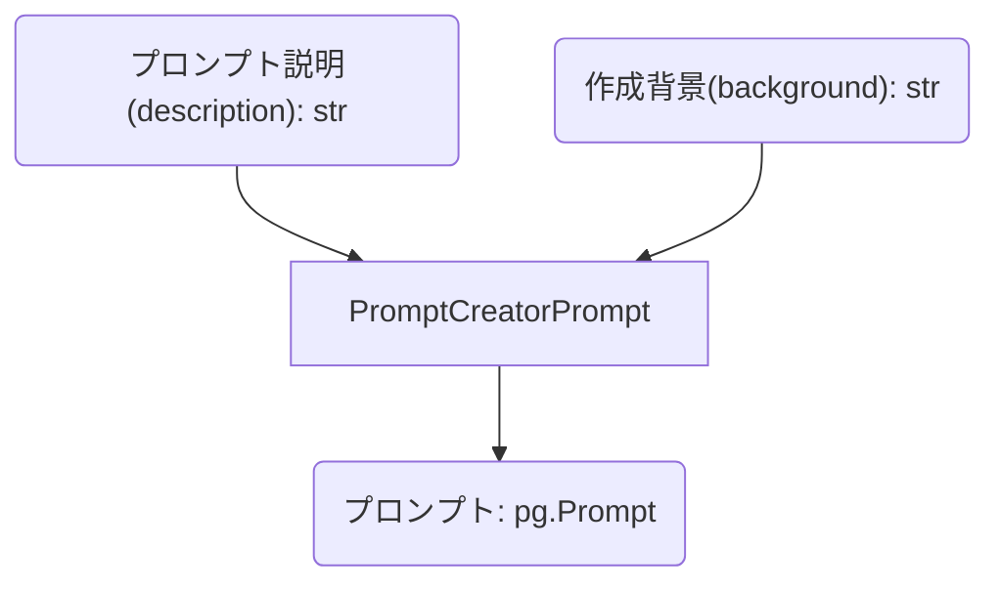
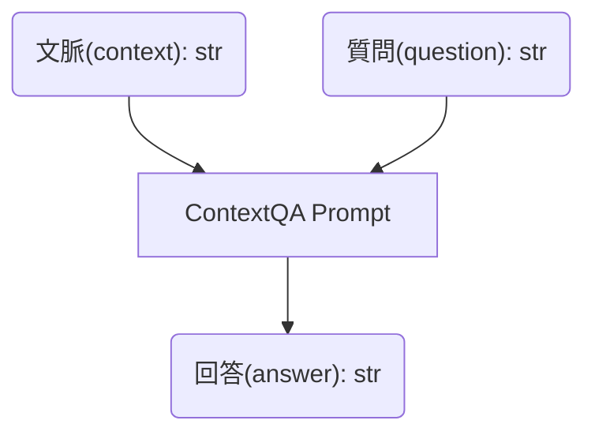

## プロンプト自動生成


`pg.Prompt` データクラスも `dict` で表せるので、「プロンプト説明」と「作成背景」を入力とし、プロンプトを生成させることができます。

PromptoGen ではいくつか事前に定義されたプロンプトがあり、そのうちの一つである `PromptCreatorPrompt` は次のような図で表される入出力パラメータを持ちます。



### プロンプト自動生成実装例

実際にプロンプト自動生成を行うコードを見てみましょう。

今回は、**文脈(context)と質問(question)を入力とし、回答(answer)を出力する** というプロンプトを作成します。



```python
import promptogen as pg
from promptogen.prompt_collection import PromptCreatorPrompt

llm = YourTextLLM(model="your-model")

formatter = pg.KeyValuePromptFormatter()
prompt_runner = pg.TextLLMPromptRunner(llm=llm, formatter=formatter)

prompt_creator_prompt = PromptCreatorPrompt()

def create_context_qa_prompt() -> pg.Prompt:
    input_value = {
        # ここでプロンプトの説明を定義
        "description": "Answer the question for the given context.",
        # ここでプロンプトの作成背景を定義
        "background": "(context: str, question: str) -> (answer: str)",
    }
    resp = prompt_runner.run_prompt(prompt_creator_prompt, input_value=input_value)
    return pg.Prompt.from_dict(resp["prompt"])

context_qa_prompt = create_context_qa_prompt()

input_value = {
    "context": "太郎は花子に花束を渡した。",
    "question": "太郎は誰に花束を渡した？",
}
output_value = prompt_runner.run_prompt(context_qa_prompt, input_value=input_value)
print(output_value)
```

```console
{'answer': '花子'}
```


## 準備

`openai_util.OpenAITextLLM` は[OpenAITextLLMページ](openai-text-llm.md) で定義した `TextLLM` です（参考: [TextLLM](../getting-started/text-llm.md)）。
同じディレクトリの `openai_util.py` にそれらを定義しておくと、`import` できます。

```python
import promptogen as pg
from openai_util import OpenAITextLLM
from promptogen.prompt_collection import PromptCreatorPrompt

llm = OpenAITextLLM(model="gpt-3.5-turbo")

formatter = pg.KeyValuePromptFormatter()
prompt_runner = pg.TextLLMPromptRunner(llm=llm, formatter=formatter)

```

## ソースコード

[context-qa.py (GitHub)](https://github.com/zawakin/promptogen/tree/742485c4690788d2866635bcd3b5eda580cf5b1a/examples/promptcreation/context_qa_prompt.py)


## プロンプトの作成

`PromptCreatorPrompt` を使用して、プロンプトを作成します。

このプロンプトは　`description` と `background` を入力として受け取り、`prompt` を出力します。

```python
prompt_creator_prompt = PromptCreatorPrompt()


def setup_context_qa_prompt() -> pg.Prompt:
    input_value = {
        "description": "Answer the question for the given context.",
        "background": "(context: str, question: str) -> (answer: str)",
    }
    resp = prompt_runner.run_prompt(prompt_creator_prompt, input_value=input_value)
    return pg.Prompt.from_dict(resp["prompt"])


context_qa_prompt = setup_context_qa_prompt()
```

LLMへの入力:

```console
-- input --
Create a prompt from the given description and background. Use the given description as the prompt description as is. Consider background information to make the prompt more specific.

Input Parameters:
  - description: description of the prompt; this will be used as the prompt description as is
  - background: background of the prompt

Output Parameters:
  - prompt: A prompt which has 'name', 'description', 'input_parameters', 'output_parameters', 'template', and 'examples'.

Template:
Input:
description: "description of sample prompt"
background: "background of the prompt"
Output:
prompt: {
 "name": "sample-new prompt",
 "description": "description of sample prompt",
 "input_parameters": (...省略)
 "output_parameters": (...省略)
 "template": "...",
 "examples": [...]
}

Example 1:
Input:
description: "Categorize the given text"
background: "The given text may be a sentence, a paragraph, or a document."
Output:
prompt: {
 "name": "TextCategorizer",
 "description": "Categorize the given text",
 "input_parameters": (...省略)
 "output_parameters": (...省略)
 "template": "...",
 "examples": [...]
}

Example 2:
Input:
description: "Generate Python code based on the given task"
background: "style: input: (task: str), output: (reason: str, code: str)"
Output:
prompt: {
 "name": "PythonCodeGenerator",
 "description": "Generate Python code based on the given task",
 "input_parameters": (...省略)
 "output_parameters": (...省略)
 "template": "...",
 "examples": [...]
}

--------

Input:
description: "Answer the question for the given context."
background: "(context: str, question: str) -> (answer: str)"
Output:
```

LLMからの出力:

```console
-- output --
prompt: {
 "name": "QuestionAnswering",
 "description": "Answer the question for the given context.",
 "input_parameters": [
  {
   "name": "context",
   "description": "The context in which the question needs to be answered"
  },
  {
   "name": "question",
   "description": "The question to be answered"
  }
 ],
 "output_parameters": [
  {
   "name": "answer",
   "description": "The answer to the question from the given context"
  }
 ],
 "template": {
  "input": {
   "context": "context",
   "question": "question"
  },
  "output": {
   "answer": "Answer"
  }
 },
 "examples": [
  {
   "input": {
    "context": "The Apollo program, also known as Project Apollo, was the third United States human spaceflight program carried out by the National Aeronautics and Space Administration (NASA), which succeeded in landing the first humans on the Moon from 1969 to 1972.",
    "question": "Which organization carried out the Apollo program?"
   },
   "output": {
    "answer": "National Aeronautics and Space Administration (NASA)"
   }
  }
 ]
}
```

## 作成したプロンプト情報の確認

```python
print(context_qa_prompt)
```

```console
QuestionAnswering: (context: str, question: str) -> (answer: str)

Description
-----------
Answer the question for the given context.

Input Parameters
----------------
- context (str): The context in which the question needs to be answered
- question (str): The question to be answered

Output Parameters
-----------------
- answer (str): The answer to the question from the given context

Examples Count
--------------
1
```

## Context QA プロンプトの実行

Context QA プロンプトを実行してみます。

```python
input_value = {
    "context": "The quick brown fox jumps over the lazy dog.",
    "question": "What does the fox jump over?",
}

output_value = prompt_runner.run_prompt(context_qa_prompt, input_value=input_value)

print(output_value["answer"])
# -> The lazy dog.
```

LLMへの入力:

```console
-- input --
Answer the question for the given context.

Input Parameters:
  - context: The context in which the question needs to be answered
  - question: The question to be answered

Output Parameters:
  - answer: The answer to the question from the given context

Template:
Input:
context: "context"
question: "question"
Output:
answer: """Answer"""

Example 1:
Input:
context: "The Apollo program, also known as Project Apollo, was the third United States human spaceflight program carried out by the National Aeronautics and Space Administration (NASA), which succeeded in landing the first humans on the Moon from 1969 to 1972."
question: "Which organization carried out the Apollo program?"
Output:
answer: """National Aeronautics and Space Administration (NASA)"""

--------

Input:
context: "The quick brown fox jumps over the lazy dog."
question: "What does the fox jump over?"
Output:
```

LLMからの出力:

```console
-- output --
answer: """The lazy dog."""
```
