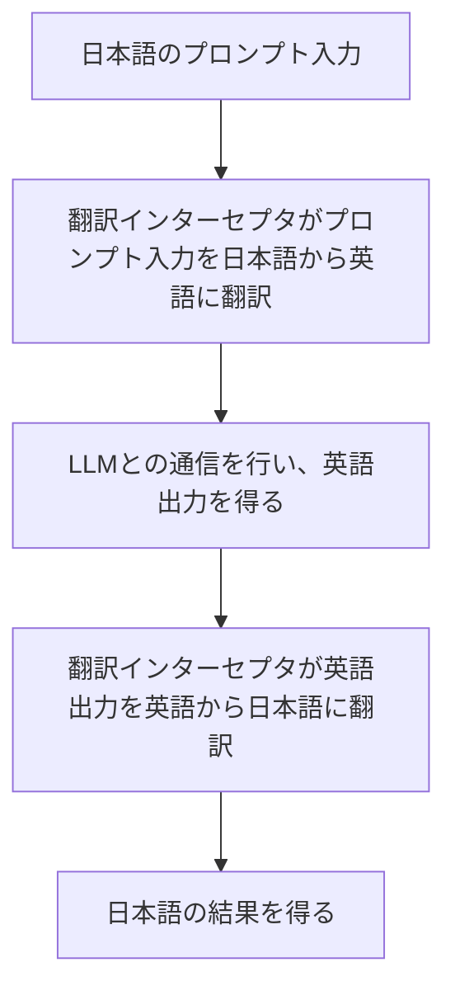

### 応用例: プロンプトインターセプタ
`TextLLMPromptRunner` では、プロンプトの前処理や後処理を行うために「インターセプタ(`PromptInterceptor`)」というインターフェイスがあります。

`PromptInterceptor` を使うことで、プロンプトの実行前に入力を書き換えたり、プロンプトの実行後に出力を書き換えたりすることができます。

例えば、 `ValueTranslationInterceptor` を使えば、 **ユーザーは日本語で通信しているようにみえるが、実際のLLMとの通信は英語で行う** ことができます。



##### 入出力翻訳インターセプタ実装例

このような複雑な処理が PromptoGen では数行変更するだけで実現できます。実際のプロンプト実行用のLLMと、翻訳用のLLMはそれぞれ別のものを使うことができます。

```python
import promptogen as pg
from promptogen.prompt_interceptor.translation_interceptor import ValueTranslationInterceptor

formatter = pg.KeyValuePromptFormatter()
llm = YourTextLLM(model="your-model")
translator_llm = YourTextLLM(model="your-model-translator")

interceptors = [
    ValueTranslationInterceptor(llm=translator_llm, from_lang="Japanese", to_lang="English"),
]

prompt_runner = pg.TextLLMPromptRunner(llm=llm, formatter=formatter, interceptors=interceptors)
# ...(略)
```

## 実装例(GitHub)

[translation_interceptor.py (GitHub)](https://github.com/zawakin/promptogen/blob/main/examples/prompt_interceptor/translation_interceptor.py)
