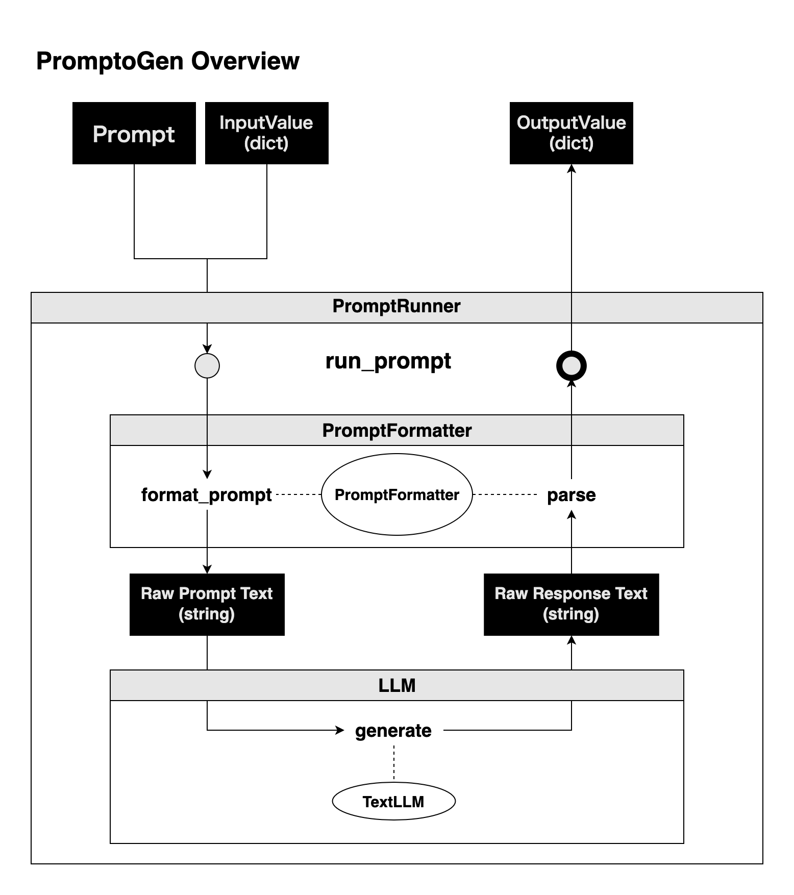

## PromptRunner: プロンプトの実行を簡略化

`pg.PromptRunner`は、PromptoGenの中核的な部分であり、ユーザーが作成したプロンプトを効率よく実行する役割を果たします。最大の特徴は、**具体的なLLMの実装を気にせずにプロンプトを実行できる** 点にあります。これにより、プロンプトの作成や管理が大幅に簡略化されます。

### 使い方:

```python
import promptogen as pg

# formatterはプロンプトのフォーマットを行うオブジェクト
formatter = pg.KeyValuePromptFormatter()

# TextLLMのインスタンス作成は`TextLLM`ページを参照
runner = pg.TextLLMPromptRunner(llm=text_llm, formatter=formatter)

# 実際のプロンプトの作成
summarizer = pg.Prompt(
    name="Text Summarizer and Keyword Extractor",
    # ...
)

# プロンプトの実行
input_value = {
    "text": "In the realm of software engineering, ...",
}
output_value = runner.run_prompt(summarizer, input_value)
print(output_value)
```

## なぜ `pg.PromptRunner` は便利か?

1. **抽象化**: ユーザーは具体的なLLMの実装を意識せずにプロンプトを実行できます。
2. **一貫性**: 同じプロンプトを異なるLLMで実行する際の変更を最小限に抑えられます。
3. **拡張性**: 新しいプロンプトの追加や既存プロンプトの修正が簡単です。

このように、`pg.PromptRunner`は、PromptoGenでのプロンプトの実行を簡便かつ効率的に行うための強力なツールとなっています。

## `PromptoRunner` の概要図

ユーザーは、利用したい `TextLLM` と `PromptFormatter` を選択し、 `PromptRunner` を作成します。

 `PromptRunner` に対し、 `Prompt` と `InputValue` を渡すことで、 `OutputValue` を取得できます。

- `PromptRunner` への入力: `Prompt` と `InputValue`
- `PromptRunner` からの出力: `OutputValue`

`PromptRunner` は、以下のような流れで動作します。

1. `Prompt` と `InputValue` を受け取る
2. プロンプト文字列を生成する
3. 生成したプロンプト文字列を `TextLLM` に渡す
4. `TextLLM` からの出力を受け取る
5. `PromptFormatter` により、出力を `OutputValue` に変換する
6. `OutputValue` を返す



## `PromptRunner` を実際に使用する

`PromptRunner` は `run_prompt` メソッドを持ちます。このメソッドは、プロンプトと入力を受け取り、出力を `Value` (つまり `dict` )にパースした結果を返します。

```python title="参考: PromptRunner抽象クラス"
class PromptRunner(ABC):
    @abstractmethod
    def run_prompt(self, prompt: Prompt, input_value: Value) -> Value:
        pass
```

### 実装例: `pg.TextLLMPromptRunner`

`TextLLMPromptRunner` によるプロンプトの実行は、以下の手順で行われます。

1. `PromptFormatter` を使用して、プロンプトと入力値をテキストにフォーマットします。
2. `TextLLM` を使用して、テキストを生成します。
3. `PromptFormatter` を使用して、生成されたテキストを解析して、`Value` を返します。

```python title="pg.TextLLMPromptRunnerの実装を覗いてみる"
class TextLLMPromptRunner(PromptRunner):
    # ...

    def __init__(self, llm: TextLLM, formatter: PromptFormatter):
        self.text_llm = llm
        self.formatter = formatter

    def run_prompt(self, prompt: Prompt, input_value: Value) -> Value:
        raw_req = self.formatter.format_prompt(prompt, input_value)
        raw_resp = self.text_llm.generate(raw_req)
        resp = self.formatter.parse(prompt, raw_resp)
        return resp
```

## 使い方

ここでは、 `TextLLM`には[TextLLM](text-llm.md)で例を出した `OpenAITextLLM` クラスを使用します。

また、実行するプロンプトは [Prompt](prompt.md) で作成した `summarizer` プロンプトを使用します。

```python
import promptogen as pg

class OpenAITextLLM(pg.TextLLM):
    # 省略

text_llm = OpenAITextLLM("gpt-3.5-turbo")
formatter = pg.KeyValuePromptFormatter()

runner = pg.TextLLMPromptRunner(text_llm, formatter)

input_value = {
    'text': "In the realm of software engineering, developers often collaborate on projects using version control systems like Git. They work together to create and maintain well-structured, efficient code, and tackle issues that arise from implementation complexities, evolving user requirements, and system optimization.",
}
resp = runner.run_prompt(summarizer, input_value)
print(resp)
# {'summary': 'Software developers collaborate using version control systems like Git to create and maintain efficient code and solve implementation and optimization issues.', 'keywords': ['software engineering', 'developers', 'collaborate', 'projects', 'version control systems', 'Git', 'code', 'implementation complexities', 'evolving user requirements', 'system optimization']}
```

