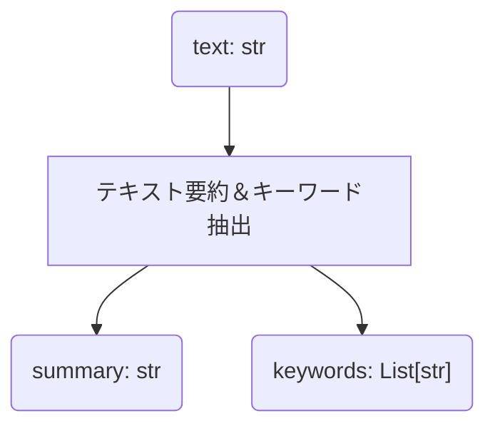

## テキスト要約＆キーワード抽出プロンプトを作成する

まずは、プロンプトを作成してみましょう。このクイックスタートガイドでは、テキストを入力として受け取り、そのテキストの要約文とキーワードを出力するプロンプトを作成します。

つまり、 `(text: str) -> (summary: str, keywords: List[str])` という関数を実現するプロンプトを作成します。



PromptoGenには、プロンプトを表現するためのデータクラス(`pg.Prompt`)が用意されています。
このデータクラスを使って、プロンプトを作成します。
このデータクラスは `pydantic.BaseModel` を継承しています。

プロンプトを作成するには、以下の情報が必要です。


| 項目                  | 引数名                           | 型                                      |
|-----------------------|--------------------------------|---------------------------------------|
| プロンプトの名前          | `name`                          | `str`                                  |
| プロンプトの説明          | `description`                  | `str`                                  |
| 入力パラメータのリスト      | `input_parameters`              | `List[pg.ParameterInfo]`               |
| 出力パラメータのリスト      | `output_parameters`             | `List[pg.ParameterInfo]`               |
| 入出力のテンプレート      | `template`                      | `pg.IOExample`                           |
| 入出力の例のリスト        | `examples`                      | `List[pg.IOExample]`                     |


これらの情報を使って、プロンプトを作成します。

```python title="quickstart.py"
--8<-- "quickstart/quickstart.py:import"

--8<-- "quickstart/quickstart.py:summarizer"
```

## プロンプトを入力パラメータなしで文字列にフォーマットする

まずは、プロンプトを入力パラメータなしで文字列にフォーマットしてみましょう。

PromptoGenでは、プロンプトを文字列にするためのフォーマッターを柔軟に作成できます。

ここでは、入出力変数のキーとバリューを `key: value` の形式で出力する `KeyValuePromptFormatter` というフォーマッターを使用します。

入力パラメータなしで文字列にフォーマットするには、フォーマッターの `format_prompt_without_input` メソッドを使用します。
このメソッドは、プロンプトとフォーマッターを引数に取り、プロンプトを文字列にフォーマットします。

```python title="quickstart.py" hl_lines="8-9"
--8<-- "quickstart/quickstart.py:import"

--8<-- "quickstart/quickstart.py:summarizer_omit"

--8<-- "quickstart/quickstart.py:format_prompt_without_input"
```

```console title="コンソール出力"
--8<-- "quickstart/output.txt:format_prompt_without_input"
```

## プロンプトを入力パラメータありで文字列にフォーマットする

続いて、プロンプトを入力パラメータありで文字列にフォーマットしてみましょう。

入力パラメータは、 `dict` を使用して指定します。

プロンプトを入力パラメータ込みで文字列にフォーマットするには、`format_prompt` メソッドを使用します。

```python title="quickstart.py" hl_lines="8-11"
--8<-- "quickstart/quickstart.py:import"

--8<-- "quickstart/quickstart.py:summarizer_omit"

--8<-- "quickstart/quickstart.py:format_prompt"
```

```console hl_lines="33-37" title="コンソール出力"
--8<-- "quickstart/output.txt:format_prompt"
```

## 大規模言語モデルを用いて出力を生成する

続いて、大規模言語モデルからの出力を生成してみましょう。

PromptoGen において、大規模言語モデルとの通信は `TextLLM` という抽象クラスを介して行います。

`TextLLM` は、PromptoGen で大規模言語モデルを統一的に扱うための抽象クラスです。
 `pg.FunctionBasedTextLLM` は、関数を用いて大規模言語モデルからの出力を生成する `TextLLM` の実装です。

```python
import promptogen as pg

def generate_text_by_text(text: str) -> str:
    # ここで大規模言語モデルからの出力を生成する
    return "<generated text>"

text_llm = pg.FunctionBasedTextLLM(
    generate_text_by_text=generate_text_by_text,
) 
```

### 例: OpenAI ChatGPT API を用いて出力を生成する

このライブラリでは、大規模言語モデルからの出力を生成するための機能は提供していませんが、OpenAI ChatGPT API などを用いることで実現できます。

ここでは、OpenAI ChatGPT API を用いて、入力テキストを要約したテキストを生成してみましょう。

あらかじめ、OpenAI API Key と Organization ID を環境変数に設定しておきます。

```python
--8<-- "quickstart/quickstart.py:import"

--8<-- "quickstart/quickstart.py:text_llm"
```

続いて、プロンプトを入力パラメータ込みで文字列にフォーマットし、大規模言語モデルからの出力を生成してみましょう。

```python title="quickstart.py" hl_lines="3-7 17-18"
--8<-- "quickstart/quickstart.py:import"

--8<-- "quickstart/quickstart.py:text_llm_omit"

--8<-- "quickstart/quickstart.py:summarizer_omit"

--8<-- "quickstart/quickstart.py:generate"
```


```console title="コンソール出力"
--8<-- "quickstart/output.txt:generate"
```

## 出力をPythonオブジェクトに変換する

続いて、LLM出力は単なる文字列なので、Pythonオブジェクトに変換してみましょう。
`formatter.parse` メソッドを使用することで、LLMからの出力文字列をプロンプトの出力パラメータを用いてパースできます。パースの結果はPythonの `dict` に格納されます。

```python title="quickstart.py" hl_lines="20-21"
--8<-- "quickstart/quickstart.py:import"

--8<-- "quickstart/quickstart.py:text_llm_omit"

--8<-- "quickstart/quickstart.py:summarizer_omit"

--8<-- "quickstart/quickstart.py:generate"

--8<-- "quickstart/quickstart.py:parse"
```

```console title="コンソール出力"
--8<-- "quickstart/output.txt:parse"
```

この出力は、LLM出力の文字列をパースした結果である `dict` です。

## まとめ

以上、PromptoGen の基本的な使い方を紹介しました。

ここまでの流れは、以下のようになります。

1. プロンプトを定義する
2. フォーマッターを定義する
3. フォーマッターを使って、プロンプトと入力パラメータを文字列にフォーマットする
4. 大規模言語モデルを用いて、出力を生成する
5. 出力をPythonオブジェクトに変換する

ここで紹介したのはシンプルな例ではありますが、PromptoGen を用いることで、より複雑なプロンプトや入出力パラメータを簡単に扱うことができます。

また、入力パタメータや出力パラメータとしてプロンプトそのものを指定することができるため、プロンプトを動的に生成することも可能です。
